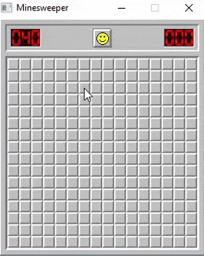

# minesweeper-rs
Cross-platform Minesweeper, Rust version. No GUI, no comments, just a classic gameplay.

# Building
I'm using `MSYS2` with `UCRT64` environment and Rust with GNU toolchain: `stable-x86_64-pc-windows-gnu`.
___
To build the project you should download MinGW development libraries:  
[SDL2-devel-2.32.2-mingw.zip](https://github.com/libsdl-org/SDL/releases/download/release-2.32.2/SDL2-devel-2.32.2-mingw.zip)  
[SDL2_image-devel-2.8.8-mingw.zip](https://github.com/libsdl-org/SDL_image/releases/download/release-2.8.8/SDL2_image-devel-2.8.8-mingw.zip)

And copy all `lib` files to your `rustup` folder, for example:
> .rustup\toolchains\stable-x86_64-pc-windows-gnu\lib\rustlib\x86_64-pc-windows-gnu\lib\

    libSDL2.a
    libSDL2.dll.a
    libSDL2.la
    libSDL2_image.a
    libSDL2_image.dll.a
    libSDL2_image.la
    libSDL2_test.a
    libSDL2_test.la
    libSDL2main.a
    libSDL2main.la
Then just `cargo build --release`, nothing more.
